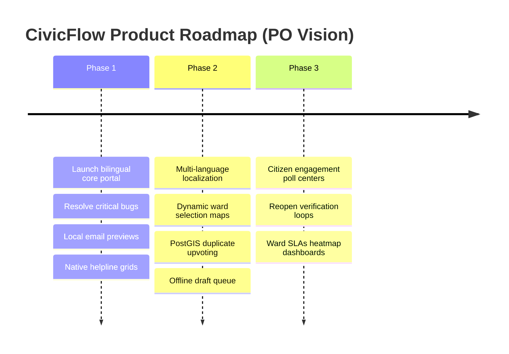

# CivicFlow Product Owner Audit: Strategic Issues & Enhancements Report

**Prepared By**: Lead Product Owner & e-Governance Architect (13+ Years Experience)  
**Date**: May 25, 2026  
**Subject**: Monorepo Product Review, PRD Gap Analysis, and Citizen-Centric Usability Recommendations  

---

## 1. Executive Summary & Vision Alignment

As a Product Owner with over a decade of experience designing and scaling e-governance platforms (similar in scope to UMANG, Swachhata-MoHUA, and India Stack integrations), I have audited every component of the CivicFlow ecosystem (**NestJS API, Next.js Web Admin, and React Native Mobile Client**). 

The platform’s core foundation—specifically the monorepo workspaces architecture, schema structures, and REST API controllers—is exceptionally robust and well-designed. However, to transition CivicFlow from a **Minimum Viable Product (MVP)** into a **competitively attractive, nation-scale, and accessible citizen super-app**, several architectural, user-experience, and feature gaps must be addressed. 

---

## 2. Product Scorecard (MVP Evaluation)

| Module | Core Strengths | Critical PO Gaps | Grade |
| :--- | :--- | :--- | :---: |
| **Backend (NestJS API)** | Scalable modular structure, clean Prisma models, PostGIS capabilities. | Lack of automatic geospatial duplicate detection, missing audit logs integrations. | **A-** |
| **Web Portal (Next.js Admin)** | Role-based layout templates, quick-action assignment dashboards. | Static circular circulars, missing live analytics charts or SLAs maps. | **B+** |
| **Mobile App (Expo Client)** | Responsive dark themes, dynamic location resolving, native OTP support. | Minimal MyGov engagement, missing offline caching, lack of dynamic map pin adjusting. | **B** |

---

## 3. High-Priority PRD Gaps & Issues (Requires Action)

The following items are defined in the PRD but have either been partially implemented or omitted in the current codebase.

### 🌐 Gap A: Native MyGov-Style Interactive Engagement Hub
* **PRD Reference**: *Section 2.3 & 6.3: "Combine MyGov-style engagement... surface polls, discussions, and campaigns within a dedicated Engage Tab or banners."*
* **Current State**: The mobile home screen features a static "Important Notice" card (Delhi road repairs), but there is no native, interactive portal where citizens can tap to participate in municipal policy-making or community budgeting.
* **PO Improvement Required**: 
  * Add a dedicated **"Engage" (सहभाग)** navigation tab in [explore.tsx](file:///c:/Users/KANDATH%20HANEESH/Desktop/CF/apps/mobile/app/%28tabs%29/explore.tsx) or a floating widget.
  * Implement an interactive local poll showing real-time community vote percentages upon casting a ballot, fostering transparency.

### 🔄 Gap B: Automated Geospatial Duplicate Ticket Detection
* **PRD Reference**: *Section 7.2 - Civic Issue Module: "Duplicate detection: server-side matching based on location radius, category, and time window; suggest joining an existing ticket instead of creating a fresh one."*
* **Current State**: When a user submits a pothole report on [report.tsx](file:///c:/Users/KANDATH%20HANEESH/Desktop/CF/apps/mobile/app/report.tsx), the API accepts it immediately without cross-referencing nearby open issues. If 10 citizens report the same pothole, the ward office receives 10 duplicate tickets.
* **PO Improvement Required**:
  * Implement a simple PostGIS radial query on the backend `POST /complaints` endpoint. If a ticket of the same category is open within a **50-meter radius**, the mobile client should display an overlay: *"This issue is already reported! Would you like to upvote and follow it instead?"*

### 📁 Gap C: Offline Caching & Submission Draft Queue
* **PRD Reference**: *Section 8 - Non-Functional Requirements: "Offline-friendly behaviors: caching of categories, draft ticket storage until connectivity is restored."*
* **Current State**: The mobile client relies entirely on active HTTP requests. If a citizen attempts to report an issue in an underground subway or low-network area, the upload fails and their entire text description is wiped.
* **PO Improvement Required**:
  * Integrate Expo's local SQLite or `AsyncStorage` to automatically save drafts when off-line.
  * Display a simple "Saved Drafts (O)" badge on the dashboard that automatically syncs to the server once online connectivity is restored.

---

## 4. Module-by-Module Usability Audits

### 📱 Citizen Mobile App (Aesthetics & Ease of Use)

* **Simplified "One-Touch" Category Grid**: 
  * Currently, categories are small horizontal scroll capsules. For kids or elder citizens with low dexterity, these targets are too small.
  * **PO Request**: Implement large, visually expressive graphic grid boxes (e.g., 🛠️ **Road Repair**, 🗑️ **Waste Cleanup**, 💡 ** streetlight Repair**) with warm gradients, making category selection instantly recognizable without reading text.
* **Language Toggle Sticky State**:
  * Toggling Hindi/English currently works perfectly, but the selected state is not stored. If a Hindi-preferred user reopens the app, it defaults back to English.
  * **PO Request**: Persist the selected language state using a lightweight key in `SecureStore` or standard AsyncStorage.

### 🖥️ Next.js Admin & ULB Web Portal

* **Interactive Ward Boundary Maps**:
  * **PRD Reference**: *Section 7.6 - Location and GIS: "Ward boundaries stored in geospatial format (PostGIS)... enabling cluster maps on admin dashboards."*
  * **Current State**: The admin portal relies heavily on plain text tabular listings.
  * **PO Request**: Implement a simple, interactive GIS Leaflet/Mapbox dashboard displaying ward boundary overlays (colored green/yellow/red depending on SLA breach count) so ward officers can visualize complaint hotspots immediately.
* **Evidence-Backed Closure (Citizen Verification Loop)**:
  * Currently, when a ticket is resolved, it transitions to `RESOLVED`.
  * **PO Request**: When a ticket is marked resolved by field staff, the citizen must receive a push notification allowing them to **Accept** or **Reopen** (within 48 hours) if the fix was unsatisfactory.

---

## 5. Strategic Roadmap (Scaling from MVP to Production)

### Recommendation Summary
By prioritizing the **Offline Draft Queue**, **PostGIS Duplicate Matching**, and **Sticky Language Settings**, CivicFlow will transition from a simple reporting form into a highly competitive, trust-building e-governance super-app suitable for official municipal deployment in smart cities across India.
